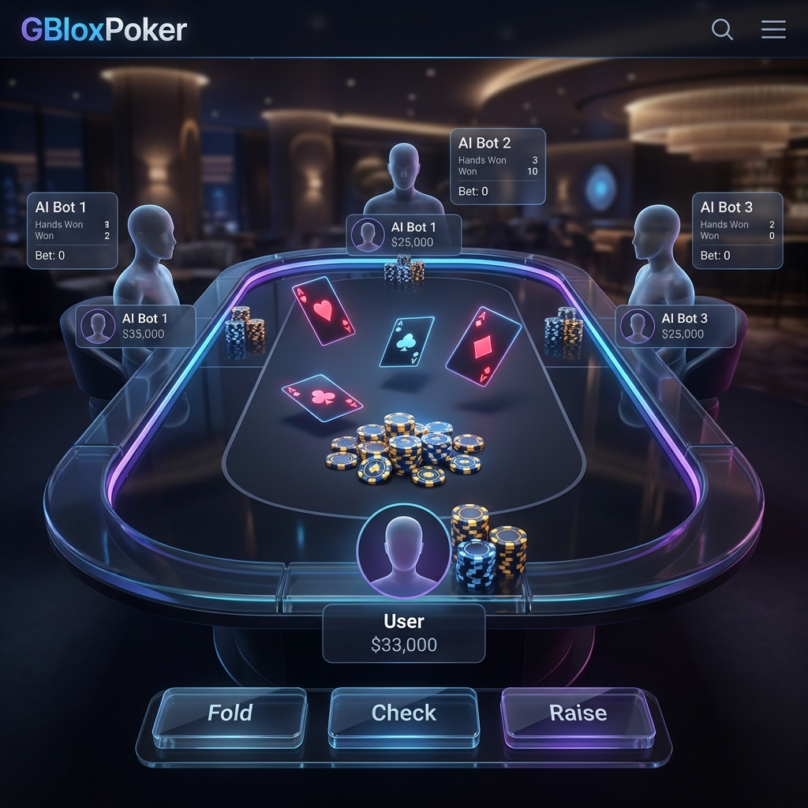

# GBloxPoker 🃏

A complete, real-time multiplayer Texas Hold'em poker platform. Play against friends online or practice against AI bots in a premium, glassmorphic poker environment.



## 🌟 Features

- **Online Multiplayer**: Real-time 2–6 player tables via a sleek Lobby system.
- **Real-time Sync**: Actions, pots, and cards synchronized instantly using Firebase.
- **Lobby System**: Create your own table or join existing ones with live player counts.
- **Turn Limits**: 30-second shot clock per player to keep the game fast-paced.
- **AI Bots**: AI opponents (Easy, Medium, Hard) fill empty seats or play in AI-only mode.
- **Premium UI**: Modern dark theme with glassmorphism, smooth CSS animations, and procedural sound effects.
- **Dealer Engine**: Robust automatic dealer handles deck shuffling, betting phases, and hand evaluation.
- **No Real Money**: Purely educational/entertainment tool using fake chips.

## 📂 Project Structure

```text
gbloxpoker/
├── lobby.html          # Multiplayer discovery and entry
├── index.html          # Main game table
├── style.css           # Premium styling, animations, and typography
└── js/
    ├── lobby.js        # Lobby creation/joining logic
    ├── multiplayer.js  # Firebase real-time sync engine
    ├── game.js         # Core game state and turn management
    ├── dealer.js       # Poker rules and phase transitions
    ├── ai.js           # Bot decision-making logic
    ├── audio.js        # Procedural sound engine (Web Audio API)
    ├── cards.js        # Card and Deck primitives
    ├── ui.js           # Dynamic rendering and animations
    └── handEvaluator.js # Advanced hand scoring logic
```

## 🚀 Setting Up Multiplayer (Firebase)

To enable the online features, you need to connect your own Firebase project:

1.  **Create a Project**: Go to the [Firebase Console](https://console.firebase.google.com/) and create a new project.
2.  **Enable Realtime Database**:
    - In the "Build" menu, select **Realtime Database**.
    - Click **Create Database** and set the location.
    - Set the **Rules** to `public` for testing (or implement Auth for production):
      ```json
      {
        "rules": {
          ".read": true,
          ".write": true
        }
      }
      ```
3.  **Get Client Config**:
    - Project Settings > General > Your Apps > Click the `</>` (Web) icon.
    - Copy the `firebaseConfig` object.
4.  **Update Source Code**:
    - Paste your config into `lobby.html` and `index.html` (inside the `<script>` tags).
    - Paste the same config into `js/lobby.js` and `js/multiplayer.js`.

## 💻 How to Run

1.  **Launch Lobby**: Open [lobby.html](lobby.html) in your browser.
2.  **Enter Name**: Set your display name.
3.  **Create/Join**: Start a new table or join one from the list.
4.  **Multiplayer Testing**: To test alone, open the game in two separate browser windows (or different browsers).

## 🛠️ Tech Stack

- **Frontend**: Vanilla JavaScript (ES6+), CSS3 (Flex/Grid/Animations), HTML5.
- **Backend**: Firebase Realtime Database (Serverless).
- **Audio**: Web Audio API (Procedural Sound Synthesis).

---

> [!NOTE]
> This project is designed for browsers that support ES Modules and the Web Audio API (Chrome, Safari, Firefox, Edge).
